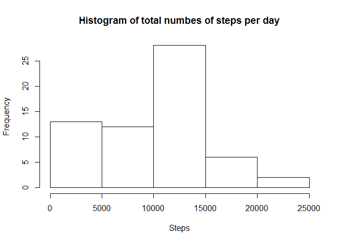
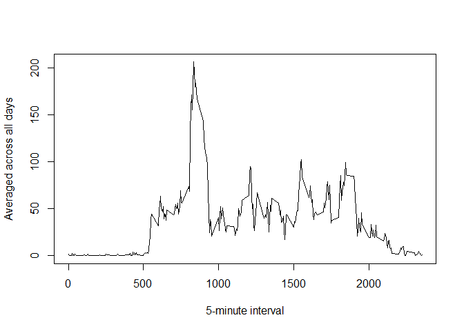
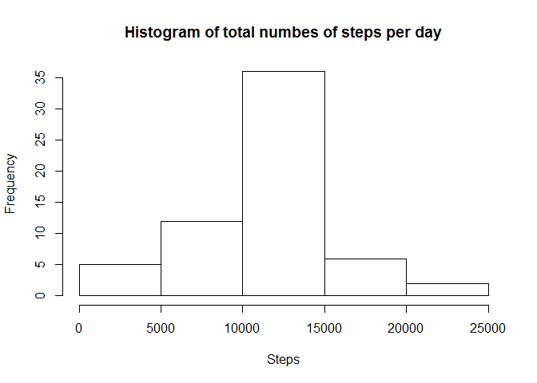
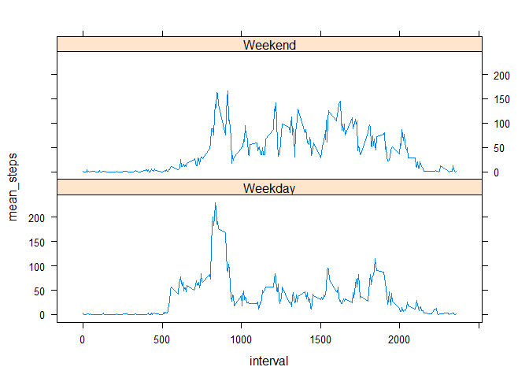

# Reproducible Research: Peer Assessment 1


## Loading and preprocessing the data

In order to better process data, we load "dplyr", "lubridate" adn "lattice" package.

```r
library(dplyr)
```

```
## 
## Attaching package: 'dplyr'
```

```
## The following objects are masked from 'package:stats':
## 
##     filter, lag
```

```
## The following objects are masked from 'package:base':
## 
##     intersect, setdiff, setequal, union
```

```r
library(lubridate)
library(lattice)
```

Read dataset into "tbl" class which offered by "dplyr".

```r
dataset <- read.csv("./activity.csv", header = T)
dataset <- tbl_df(dataset)
```

## What is mean total number of steps taken per day?

1. Calculate the total number of steps taken per day.

```r
total_per_day <- dataset %>%
  group_by(date) %>%
  summarize(total_steps = sum(steps, na.rm = T))
```

2. Plot histogram of the total number of steps taken per day.

```r
hist(total_per_day$total_steps, main = "Histogram of total numbes of steps per day", 
     xlab = "Steps")
```

\

3. The mean and median steps taken per day are 9354.23 and 10395 respectively.

```r
mean(total_per_day$total_steps)
```

```
## [1] 9354.23
```

```r
median(total_per_day$total_steps)
```

```
## [1] 10395
```


## What is the average daily activity pattern?

1. The following time series plot shows the daily activity pattern.

```r
mean_by_interval <- dataset %>%
  group_by(interval) %>%
  summarize(mean_steps = mean(steps, na.rm = T))
plot(mean_steps ~ interval, data = mean_by_interval, type = "l", 
     xlab = "5-minute interval", 
     ylab = "Averaged across all days")
```

\

2. The 835th time interval during the day has the max number of steps 206. 

```r
with(mean_by_interval, interval[which.max(mean_steps)])
```

```
## [1] 835
```

```r
max(mean_by_interval$mean_steps)
```

```
## [1] 206.1698
```

## Imputing missing values

The dataset contains 2304 missing values.

```r
sum(is.na(dataset$steps))
```

```
## [1] 2304
```

We propose to use mean value for each 5-minute interval to replace missing value. We assigan original dataset to a new dataset called "dataset_imputed". Then we assigan mean value from each interval to its corresponding missing value.

```r
dataset_imputed <- dataset
index <- match(dataset_imputed$interval[is.na(dataset_imputed$steps)], 
               mean_by_interval$interval) 
dataset_imputed$steps[is.na(dataset_imputed$steps)] <- 
  mean_by_interval$mean_steps[index]
```

Then we have the histogram for the imputed data.

```r
total_per_day_imputed <- dataset_imputed %>% 
  group_by(date) %>%
  summarize(total_steps = sum(steps))
hist(total_per_day_imputed$total_steps, main = "Histogram of total numbes of steps per day", 
     xlab = "Steps")
```

\

## Comparing differences in activity patterns between weekdays and weekends

We create a new factor called "weekday" to indicate whether a given date is a weekday or weekend day. 

```r
dataset_imputed <- dataset_imputed %>%
  mutate(weekday = weekdays(ymd(date), abbreviate = T)) %>%
  mutate(weekday = as.factor(sapply(weekday, function(x) {
    if(x %in% c("Mon", "Tue", "Wed", "Thu", "Fri")) {
      tmp <- "Weekday"
    } else {
      tmp <- "Weekend"
    }
    return(tmp)
  })))
```

Then the dataset has been summarized by interval and comparing in time series plot.

```r
by_interval_weekday_imputed <- dataset_imputed %>%
  group_by(interval, weekday) %>%
  summarise(mean_steps = mean(steps))

xyplot(mean_steps ~ interval|weekday, data = by_interval_weekday_imputed, 
        type = "l", layout = c(1, 2))
```

\


